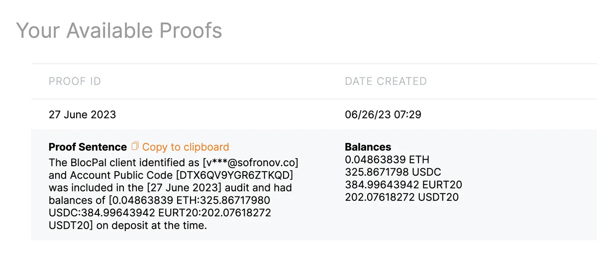
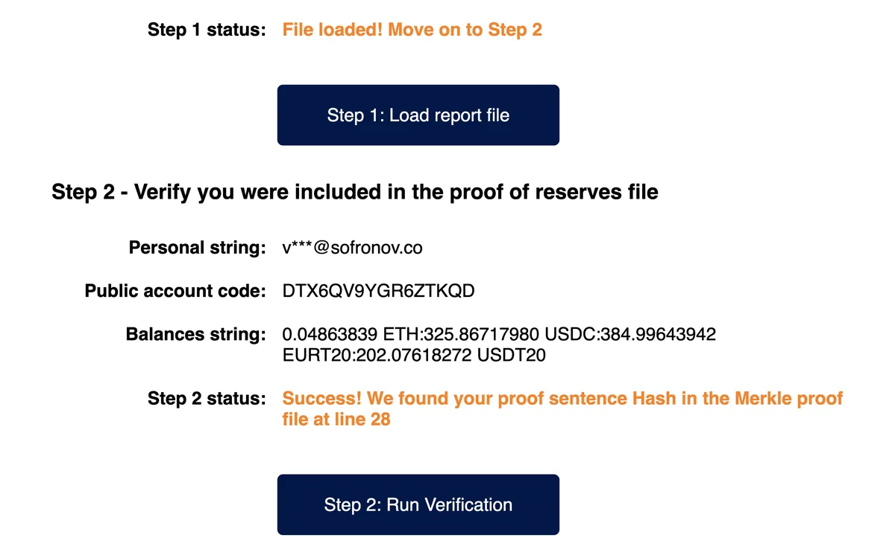
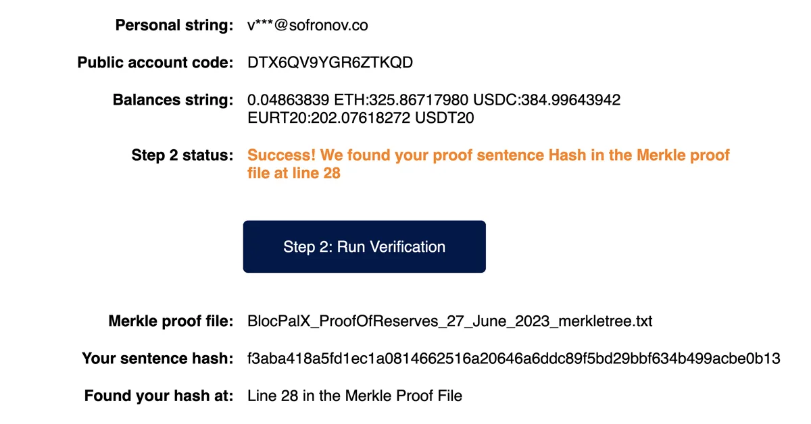
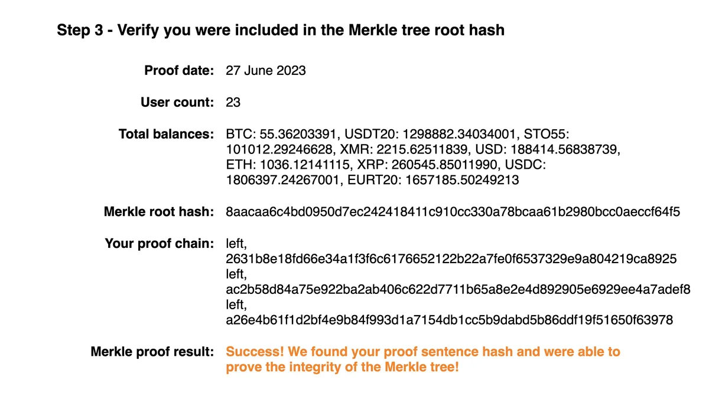
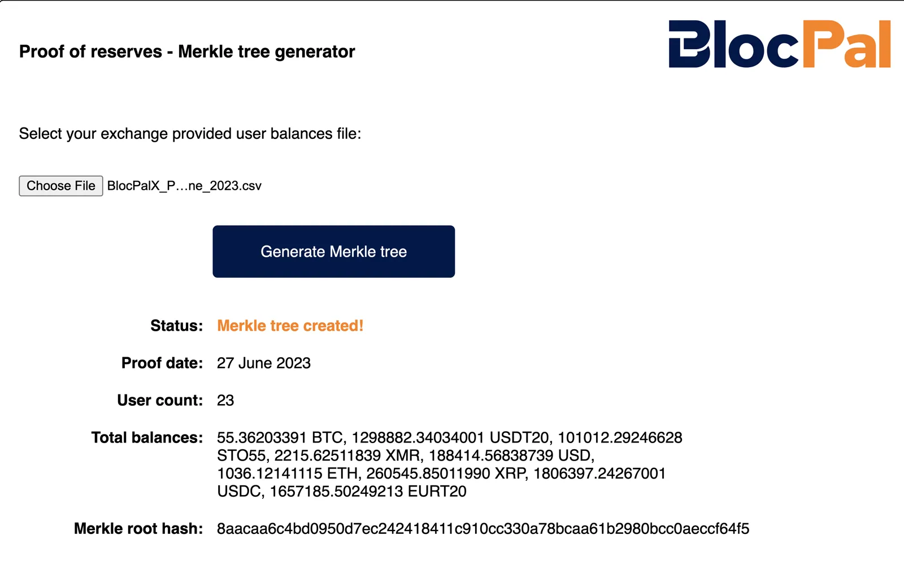
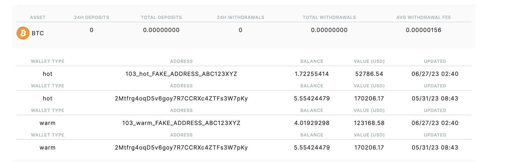
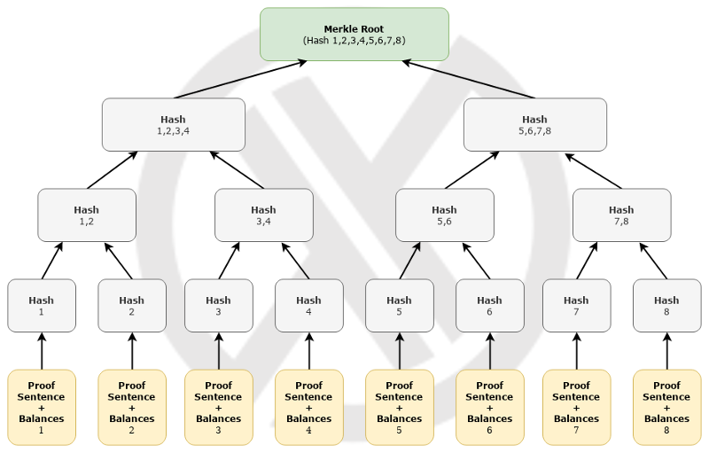

# BlocPalX proof-of-reserves

Welcome to the [BlocPalX](https://x.blocpal.com/?utm_source=githhub.com&utm_medium=referral&utm_content=proof_reserve_page) proof of reserves audit tools.  This document explains the BlocPalX **proof of reserves** system, and the accompanying tools which we provide to make it easy for our clients to participate.

## Table of Contents
- [Proof-of-reserves](#blocpalx-proof-of-reserves)
    - [Table of contents</strong>](#table-of-contents)
    - [Released audit assessments](#released-audit-assessments)
    - [Background](#background)
    - [Getting started as a BlocPalX client](#getting-started-as-a-blocpalx-client)
    - [Client participation overview](#client-participation-overview)
    - [Full audit process](#full-audit-process)
    - [Technical background](#technical-background)
    - [Installation](#installing-this-software-yourself)
    - [Usage](#usage)
    - [Credits](#credits)
    - [License](#license)

## Released audit assessments

| Proof Id | Date | Audit organization | Status |
| ---------- | ------ | ------------------------ | -------- |
| TBD          | TBD           |               | WIP      |


## Background

One of the core problems with cryptocurrency exchanges such as MtGox, WeExchange, BitFunder, QuadrigaCX and FTX is transparency. All operated as fractional reserve exchanges for a long time and subsequently collapsed.

Customers need a way to confirm that the service they are using does hold 100% of their funds and is not insolvent. Hence, developers in the crypto community have come up with the idea to utilize sha256 hashes and use a Merkle trees approach to give customers the ability to verify their funds are fully represented in a set of exchange-provided public balance data.

Previous implementations of **proof of reserves** systems needed to be easier for non-techies to use, reducing the ability of customers to participate. BlocPalX has fine-tuned these concepts to make it as easy as possible to participate in our **proof of reserves** process because the integrity of it depends on having as many participants as possible.

## Getting started as A BlocPalX client

If you want to dive right in, you can start by browsing to one of the participating verification websites:

[BlocPalX - proof of reserves.](https://blocpal-inc.github.io/proof-of-reserves/) 

[Quadriga Initiative.](https://quadrigainitiative.org/proof-of-reserves) (coming soon)

Then follow the instructions provided.

## Client participation overview

### STEP 1 - Copy your proof sentence from the BlocPalX website.

Log into your BlocPalX account and browse to [Account], [Proof of reserves]. (https://x.blocpal.com/account/profile/proofOfReserves) On that page you can see a list of all of the audits that have been done and your proof sentence for each audit. Copy your proof sentence from the proof of reserves report you want to participate in. 

   <p align="center"> 
    
   </p>

### STEP 2 - Verify you were included in the proof of reserves file.

Browse to one of the **verification websites** listed above and paste in your **proof sentence**. After you have pasted your **proof sentence** into the **verification website**, click the "Load report file" button.  The tool will download the **proof of reserves** file from GitHub. After the **report file** is loaded, next click the "Run verification" button.

   <p align="center">
    
   </p>

You should see a successful result looking something like this:

   <p align="center">
    
   </p>

And further down on the page you should see verification of the **Merkle proof** result as well:

   <p align="center">
    
   </p>

That's it!

## Full audit process

### PART 1 - (Trusted third party / auditor tasks) proof of liabilities.

#### STEP 1(A): A trusted third party (typically in the role of an auditor) generates the **Merkle tree** with data provided by BlocPalX.

BlocPalX provides the trusted third party with the GitHub link to download anonymous details of user data and user balances on a per-token basis.  Every download of audit data from the exchange platform generates a unique **proof id**, which can be used to reference each unique **Merkle tree proof** throughout the process. The trusted third party then imports the downloaded CSV file into root-hash-generator.html to generate an audit report, including the total balances and the **Merkle tree root hash**.

   <p align="center">
    
   </p>

#### STEP 1(B): The auditor verifies the total user balances and publishes the merkle tree and root hash.

After the **Merkle tree** is successfully generated in root-hash-generator.html, its root hash together with user count and total amount of user balances will be calculated and displayed to the trusted third party for verification.

The leaves of the **Merkle tree** will be saved in a plain text file, which will be publicly shared to customers via this GIT repository, allowing all users to verify their account balances are properly represented.

#### STEP 1(C): The trusted third party publishes a table of the assets, proof id's, and the ,Merkle tree hashes for each proof.

The trusted third party now must independently publish the resulting data from their audit process, this should include a table indicating each asset audited, it's proof id, and the resulting **Merkle tree root hash**. Following this publication, the trusted third party will provide BlocPalX with the generated **Merkle tree proof file** for publication to the BlocPalX GIT repository. 

### PART 2 - (Independent And Optional BlocPalX User Tasks) proof of liabilities.

#### STEP 2(A): Users collect their proof sentence from the BlocPalX website.

Users wishing to verify their balance is represented in the **Merkle tree** will need to log into their BlocPalX account, browse to their account **proof of reserves** page, and look up their **proof sentence** as of the time that **merkle tree proof** was created.

   <p align="center"> 
    
   </p>

#### STEP 2(B): Users download and install this software

Users wishing to run their own in-depth proof may download, inspect, install, and run this software from their local desktop, or optionally use one of the participating verification websites listed above. We recommend using either this software directly or using one of the 3rd party verification sites rather than the BlocPalX site because we could theoretically alter it on our servers, and thus it is better if you are able to run the proof somewhere outside our control.

#### STEP 2(C): Users independently verify their account balances are represented

Finally users must open index.html in their browser. Then the user must input their own Proof Sentence and follow the instructions to run the verification process. If the user data and balance provided matches the record in the Merkle Tree, a successful result will be displayed together with the node location of the user information within the Merkle tree. The Merkle Tree's root hash will be re-calculated using the imported file so that the user can verify the root hash and compare it to the root hash the trusted third party published in Step 1(C) above to ensure the correctness and completeness of the **Merkle tree**.

   <p align="center">
    
   </p>

### PART 3 - (All participants) proof of assets.

#### STEP 3(A): The public and/or trusted third party identifies and verifies that BlocPalX owns blockchain wallets.

BlocPalX provides the public with blockchain addresses used to store customer assets. These addresses are available at https://x.blocpal.com/walletStatus. To prove ownership of these addresses, BlocPalX conducts transactions moving small, pre-determined amounts from each major wallet identified. These transactions can be observed by the public and a trusted third party on a periodic basis.

   <p align="center">
    
   </p>

#### STEP 3(B): The public and/or trusted third party adds up the balances all BlocPalX public chain wallets.

The public or a trusted third party is able to take all of the balances of the wallets owned by BlocPalX and sum them all up, coming up with a total value of each asset.

### PART 4 - (All participants) final proof of reserves.

#### The trusted third party proves BlocPalX is not operating as a fractional reserve.

The trusted third party takes the resulting sum of the value of the assets from Step 3(B), and subtracts the resulting sum of the value of the liabilities from Step 1(B). The assets should always exceed the liabilities, otherwise the exchange is operating as a fractional reserve and deposits are not fully backed.

## Technical background

* ### What is a **Merkle tree?**

In cryptography and computer science, a hash tree or Merkle tree is a tree in which every leaf node is labelled with the cryptographic hash of a string of data, and every non-leaf node is labelled with the hash of the labels of its child nodes. Hash trees allow efficient and secure verification of the contents of large data structures.

   <p align="center">
    
   </p>

* ### How do you build the Merkle tree with user proof sentences and balances?

The user's proof sentence hash and balances are first exported from BlocpalX's database. Before export, each proof sentence is hashed using sha256 to protect your **proof sentence**. Then when generating the Merkle tree and the root hash, we combine your proof sentence hash and your balances string, hash them using sha256, and the resulting hashes are used to generate the leaf nodes of the Merkle tree. 

We then use a third-party Merkle Tree library (Javascript: merkle-tools) to input all of the sha256 leaf nodes and generate the tree, visually represented in the illustration above. After the Merkle tree is successfully built, the data used to make it and the final **root hash** are exported into a plain text file, which is published to GitHub for public access.

* ### How do you verify a user's Proof Sentence and Balances using a Merkle Tree Proof?

To verify the Proof Sentence and Balances, we need to construct the entire Merkle Tree and generate a Merkle Proof to verify inclusion within the Merkle Tree.

Merkle proofs are created by starting with the sha256 hash of the proof sentence and balances string combined and then climbing up the tree until obtaining the **root hash88, which has been published to GitHub by the auditor in Step 1(C).

After re-creating the tree using the third-party Merkle tree library (Javascript: merkle-tools), you can fully climb the tree and calculate the root hash at the top.  If the root hash calculated in your proof matches the root hash the auditor published to GitHub, then you have proven that your proof sentence and balances, as represented in the report file, were included in the same Merkle tree the auditor used to calculate the total exchange balances.


## Installing this software yourself

Please reference the LICENSE prior to installation. This software is FREE to use for most parties, but not all.

> Install dependencies

  ```shell
  npm install
  ```

> Install build tool

  ```shell
  npm install -g browserify watchify
  ```

> Create bundle.js to make it runanble in browser

  ```shell
  browserify js/proof.js -o js/bundle.js
  ```

> To achieve auto build of bundle.js, use watchify as shown below, or use nohup to make watchify command running at background

  ```shell
  nohup watchify js/proof.js -o js/bundle.js -v > nohup.out 2>&1 </dev/null &
  ```

## Usage

* If you are the **auditor**, you open **`root-hash-generator.html`** in your browser, import the exchange provided file with user data and user balances to build and export the Merkle Tree file.

* Users open **`index.html`** in their browser, paste their **proof sentence**, and follow the instructions to validate their **proof sentence** and balance combination exists in the Merkle tree file.

## Credits

The process of using Merkle trees as a tool for the roof of reserves is conceptually derived from the work of many.  Development of this specific implementation utilizing proof sentences is the result of a collaborative effort between BlocPalX, TxQuick and The Quadriga Initiative (https://www.quadrigainitiative.org/) as well as many long discussions with the Calgary-based CryptOasis crew.

This software was created by BlocPalX to provide a reference implementation and to facilitate adoption.

## License

Copyright ©2023 BlocPal international.

Licensed under the **[BlocPalX proof of reserves](LICENSE)** license. Please review the license prior to use.
